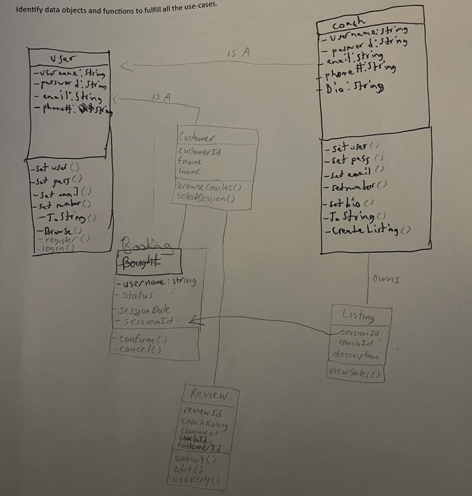

# Super Smash Bros Coaching API

## UML Class Diagram

#

---

## API Endpoints

### Customer Management

#### Create Customer: POST /customers

```json
{
  "username": "michael123",
  "password": "pass",
  "email": "michael@test.com",
  "phone": "123456",
  "fname": "Michael",
  "lname": "Chatman"
}
```

**Response:** 200 OK

---

#### Update Customer: PUT /customers/{id}

```json
{
  "username": "franklin123",
  "password": "pass",
  "email": "franklin@test.com",
  "phone": "123456",
  "fname": "Franklin",
  "lname": "Saint"
}
```

**Response:** 200 OK or 404 Not Found

---

#### Delete Customer: DELETE /customers/{id}

**Response:** 200 OK or 404 Not Found

---

## Listing Management (Super Smash Bros Coaching)

### Supported Game Enum Values

| Enum Value | Game Title                 |
| ---------- | -------------------------- |
| OG         | Super Smash Bros.          |
| Sixty      | Super Smash Bros. 64       |
| Melee      | Super Smash Bros. Melee    |
| Brawl      | Super Smash Bros. Brawl    |
| For        | Super Smash Bros. 4        |
| Ult        | Super Smash Bros. Ultimate |

---

### Create Listing: POST /listings

```json
{
  "game": "Ult",
  "experience": "Top Elite Smash player with tournament experience",
  "mainC": "Fox",
  "price": 20.0,
  "sessionType": "1-on-1",
  "bio": "I specialize in neutral, combos, and matchup knowledge."
}
```

**Response:** 200 OK or 400 Bad Request

---

### Get All Listings: GET /listings

**Response:** 200 OK or 404 Not Found

---

### Get Listing by ID: GET /listings/{id}

**Response:** 200 OK or 404 Not Found

---

### Update Listing: PUT /listings/{id}

```json
{
  "game": "Ult",
  "experience": "Top 100 online ranked player",
  "mainC": "Joker",
  "price": 35.0,
  "sessionType": "1-on-1",
  "bio": "Advanced coaching for competitive players."
}
```

**Response:** 200 OK or 404 Not Found

---

### Delete Listing: DELETE /listings/{id}

**Response:** 200 OK or 404 Not Found

---

### Filter Listings by Game: GET /listings/game/{game}

**Example:** `/listings/game/Melee`

---

### Filter Listings by Character: GET /listings/character/{mainC}

**Example:** `/listings/character/Fox`

---

### Filter Listings by Price Range: GET /listings?minPrice=10&maxPrice=50

---

## Booking & Reviews

### Create Booking: POST /bookings?customerId=1&listingId=1

**Response:** 200 OK or 404 Not Found

---

### Create Review: POST /reviews?customerId=1&listingId=1

```json
{
  "rating": 5,
  "comment": "Great session!"
}
```

**Response:** 200 OK or 404 Not Found

---

## Use Case Mapping

| Use Case    | Description                        | Related Endpoints                    |
| ----------- | ---------------------------------- | ------------------------------------ |
| US-CUST-001 | Register & manage customer profile | POST /customers, PUT /customers/{id} |
| US-CUST-002 | Browse Smash coaching listings     | GET /listings, GET /listings/{id}    |
| US-CUST-003 | Purchase a coaching session        | POST /bookings                       |
| US-CUST-004 | Write a review                     | POST /reviews                        |
| US-CUST-005 | Delete customer profile            | DELETE /customers/{id}               |
| US-LIST-001 | Create a Smash coaching listing    | POST /listings                       |
| US-LIST-002 | View all listings                  | GET /listings                        |
| US-LIST-003 | View listing details               | GET /listings/{id}                   |
| US-LIST-004 | Update listing                     | PUT /listings/{id}                   |
| US-LIST-005 | Delete listing                     | DELETE /listings/{id}                |
| US-LIST-006 | Filter listings by game            | GET /listings/game/{game}            |
| US-LIST-007 | Filter listings by character       | GET /listings/character/{mainC}      |
| US-LIST-008 | Filter listings by price           | GET /listings?minPrice=&maxPrice=    |

---

## Notes

* `game` must match enum values: OG, Sixty, Melee, Brawl, For, Ult
* Stored as STRING in database
* Required fields: game, experience, price, sessionType
* Optional fields: mainC (character), bio
* sessionId is auto-generated
